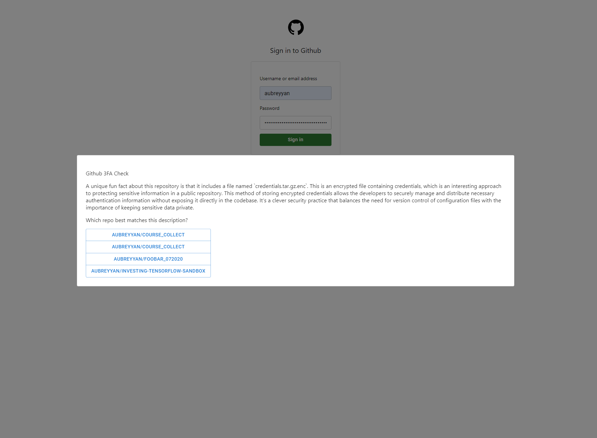

# Github 3FA

We already have enough of 2 factor authentication, but what if we went a step further and did three step authentication
on Github?

Well now it's possible in a really unique way using the greptile api, which allows us as the service to use prompt
engineering to achieve a unique feature that could in theory be used as a (relatively deficient) method of
authentication.

This project is a serverless webpage that leverages both the Github and Greptile api to enable us to ask any user, upon
logging in, a unique question about one of their repositories. Similar to how you might be asked about past addresses on
a credit application, this feature asks you to match a unique element of a project on your Github account to that
project, given some random choices.

# How do I setup?

This project was written using nvm-for-windows v1.1.12, npm v10.8.2, and node v22.6.0.

Make sure to copy `.env.template` to `.env` and fill in the greptile API key.

Then, you can simply run `npm start` and the webpage should be available at `http://localhost:3000`.

You'll be greeted by a mock github login screen, and this is important, **instead of entering your github password,
enter a valid Github PAT (Personal Access Token) with repository read permissions**.

Then, click login, and you'll have to wait a while due to how long it takes to process a greptile query.

Then, you will be given a prompt with an AI generated "fun fact", and you have one attempt to match it to the correct
repository, which you would know if you were the real "you". Feedback on that answer is given via an alert component.

You can refresh the page to try again at any time.

I note this in the source code, but there's a bug in my code that I don't have the time to figure out, which is that
I'm getting the right response from greptile about whether a repository has been indexed or not, but (I think) due to
some async/await issues, my code isn't blocking on that request and assumes that the repository has been indexed, which
causes issues for repositories that haven't been indexed. This bug can be sidestepped by just always triggering the
index query, and after a short while the indexing will be done and you are able to proceed on that repo.

Of course, one of the issues is that if you have a lot of repos, this app randomly selects one of them each time. So,
my recommendation would be to uncomment L117 in App.js, and specify a version. So you don't have to waste greptile
compute by indexing everything, which would also work and would probably be how something like this would work in prod
for a company like Github anyway, at least based on some sort of caching system based on recently active users.

And I feel obligated to mention that obviously this is a heavily imperfect authentication system. Any serious hacker is
going to pry into your public github profile to get the correct answer for 3fa, and this can be improved by adding some
timer in which we expect an answer, or this could only work on private repos, but most github users have predominantly
public repos, so this isn't a serious attempt at pushing a new authentication feature. Just a fun project.
